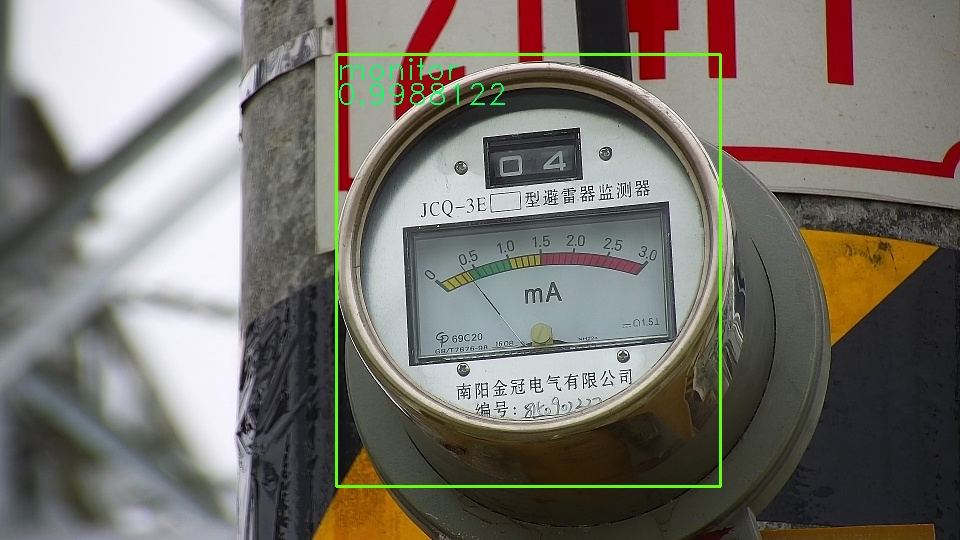

<script type="text/javascript" async src="//cdn.bootcss.com/mathjax/2.7.0/MathJax.js?config=TeX-AMS-MML_HTMLorMML"></script>
<script type="text/javascript" async src="https://cdnjs.cloudflare.com/ajax/libs/mathjax/2.7.1/MathJax.js?config=TeX-MML-AM_CHTML"></script>
# 电表类型探测（tensorflow小实战）
## 1. 简介

 实现对于高压作业中实现机器视野自动识别电表或者一些其他仪器的算法设计，就是一个图像处理，随着深度学习近年来的发展，对于图像处理算法的设计深度学习是一个很好的选择。这个实验就是基于tensorflow框架实现的


## 2. 目录结构

```c
|---test                /*测试的python代码*/
|   |---result_photo    /*储存测试结果图片*/    
|   |---save            /*存放tensorflow的Saver*/
|   |---test_photo      /*测试用的图片*/
|---train               /*训练的python代码*/
|   |---save            /*存放tensorflow的Saver*/
|   |---train_data      /*训练用的图片*/
```

## 3. 需要环境

我是在win10下面，python3.6.3，使用的`pip install tensorflow`命令安装的python-tensorflow。


## 4. 分析详解

对于高压线路中识别电子仪表，我们选择了使用tensorflow框架。在tensorflow框架里面我们选择卷积神经网络，因为卷积神经网络可以用来用来识别缩放、位移及其他形式扭曲不变性的图形，而且避免了显示的特征抽取，它是隐式地从训练数据中进行学习。而且它还有一个很大的优点就是权值共享降低了网络的复杂性和很大程度上降低网络的复杂性。例如这次的高压仪表识别中的图片像素是1920×1080，那么一张图片的像素就是2073600，差不多200万像素，接下来如果连接一个相同大小的隐藏层，那么就是200万×200万=4万亿个连接，就仅仅一个全连接层就有4万亿个参数，这肯定是不行的，远远超出了计算机的训练速度，而且后面我们还有对视野中仪表进行定位，那么运算量就会又上一个等级。这肯定是不行的，因为这已经超出了计算机的运算速度。不适用于这次的高压电表识别。所以我们选择卷积神经网络，使用参数共享，降低参数的数量，提高识别速度。
卷积神经网络对于每一个数据处理的输入和输出的计算公式都为：$y = wx + b$；w和b都是权值，而程序里面对于w的初始赋值是让w矩阵符合正态分布的赋值，这有利于后面参数的优化速度。而对于b的初始赋值全部为0.1。而不是零，这样可以防止回归函数进入死区。
因为输入原图像的像素是1920×1080，在一定程度上有的像素数量多对于特征的提取会降低运算速度，而我们我们对原始图像进行缩小，对图片在一定程度上的缩小是不会改变图片的特征的，所以我们选择输入像素为40×40，裁剪后的图片经过缩小后的像素为40×40。而对于卷积核大小的选择，根据工程经验我们选择4×4的卷积核，池化层选择2×2，水平和竖直步进都为2。Padding选择补充扩展周围。
而对于用来训练的图片，我们通过PS对原始图片进行人工裁剪，刚好裁剪出仪表的大小，最后都伸缩为相同大小的图片，因为卷积神经网络的输入节点个数是固定的，然后将不同仪表的图片分类放到不同的文件夹下面。然后通过python的OS模块对文件夹进行访问，得到训练图片，因为训练图片的数量是不定的。而且读取图片的顺序是一个一个文件夹读取，着就会导致连续的训练图片都是同样的图片，没有随机性，或者一个很好的分布性，在训练的时候训练参数的跳动很大，很难满足同时识别很多类图片，所以我们写了一个得到下一次训练batch的函数def get_next_data(images, labels)，通过选择每个不同文件夹里面的图片形成一个batch。作为训练的batch。
最终我们的模型选择两个卷积池化层，一个全连接隐藏层和一个最后的全连接输出层。损失函数选择cross_entropy = $$-\frac{\sum_{k=1}^nP_nlnY_n}{n}$$。其中$P_n$表示正确的标注，也就是我们程序里面one hot编码的y_数值。而Y_n则是我们最后的全连接输出层的输出数组，cross_entropy描述了两个数组的相似程度，也就是训练结果与标准结果的相似程度。优化器我们选择AdamOptimizer优化器。此函数是Adam优化算法。是一个寻找全局最优点的优化算法，引入了二次方梯度校正。相比于基础SGD算法，1.不容易陷于局部优点。2.速度更快。
训练过后我们使用saver.save(sess, 'save/')函数把训练向量图和训练的参数储存在save文件夹下。这是训练好的参数，理论上训练的图片越多，标注的越多，适应性也越好，正确度也越高。而后面我们就可以通过saver.restore(sess, 'save/')直接从save文件夹下面读取训练好的参数用来后面的直接识别。
最后的识别并且标注位置，我们使用一个比较简单的方法，就是在一张图片里面截取不同大小的图片。不同大小的图片在整张图片里面移动获得不同位置的图片，将每张图片进行缩放处理，缩放成卷积神经网络的输入节点40×40的大小。而缩放的过程我们使用了开源视觉库opencv里面的cv2.resize函数对图片进行缩放。最开始我们使用的是tensorflow自己的缩放函数tf.image.resize_images但是有一个很严重的问题就是速度问题，tensorflow的缩放库函数运行得很慢，因为我们会对很多张图片进行缩放，这就导致识别一张图片的速度差不多一分钟一张。而且每一次迭代都会在graph里增加新的节点，导致memory leak，程序越来越慢。到后面都是半个小时一张了。所以我们选择使用opencv对图像进行缩放。最后把缩放的图像按缩放的顺序直接输入给卷积神经网络。得到y_val，因为我们的分类里面有一个other类，为了让其他的分类更加明显，我们增加了这个类。把得到的y_val数组里面other类全部清零，然后寻找数组里面最大的数，如果这个数大于0.98代表图片中有我们需要的分类图片。然后根据y_val数组的顺序用return_position函数得到这张截取的图片在原始图片的位置和大小。最后标注圈住。


## 5.结果分析
因为在设计卷积神经的层数的时候考虑到速度的问题，对于输入的图片进行了较大的图片压缩，把原始图片压缩了10倍传入tensorflow的，这样就大大降低了准确性，运行train目录下的代码，最后得到的对图片分类的准确率大致在93%左右。然后再测试那边识别一张大图片，准确率大大下降，这也是截取图片进行缩放作为输入的弊端，截取的图片过于多的话，运算量大大增加，导致速度大大下降，而且准确率也极低，这也是普通CNN的弊端。
## 6.运行结果

